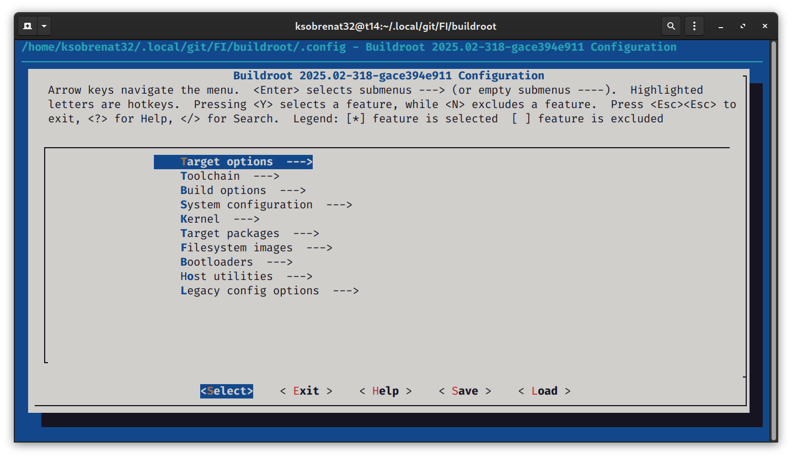
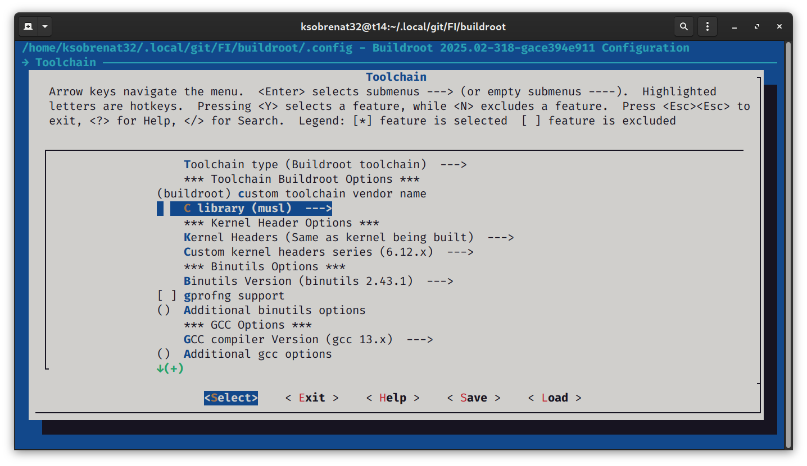
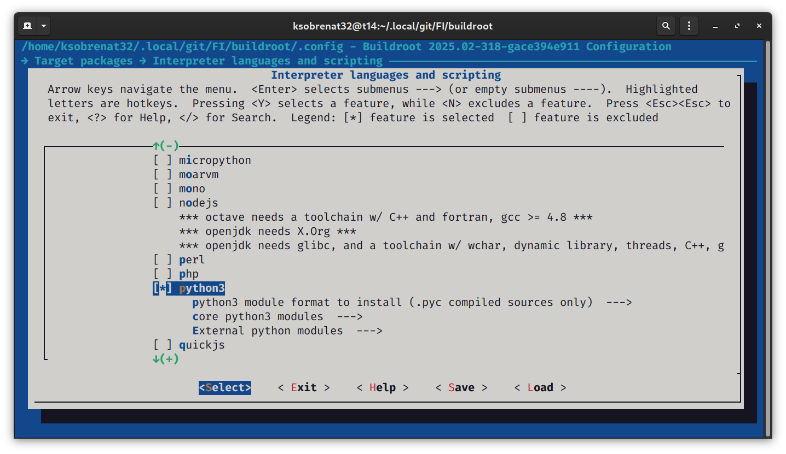
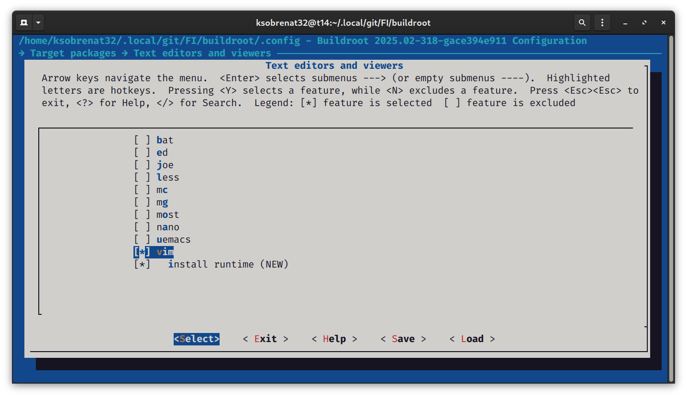
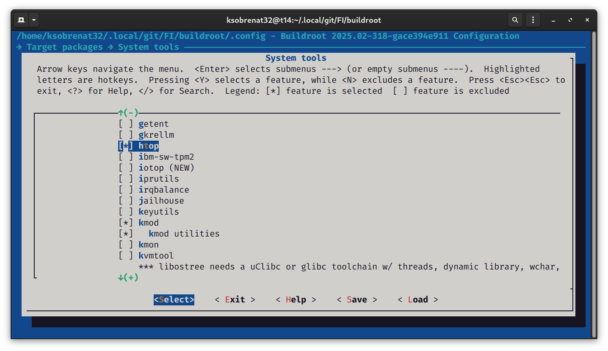
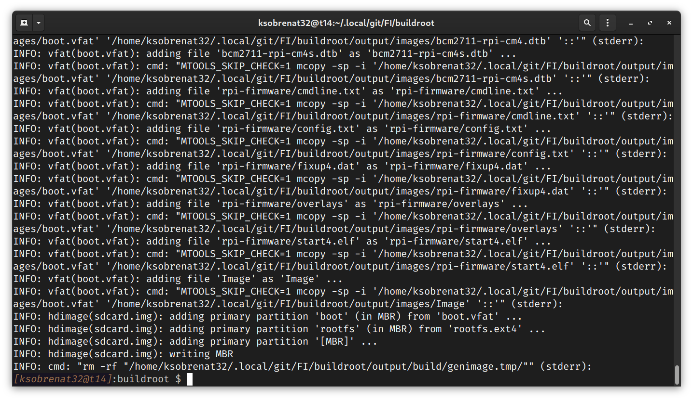
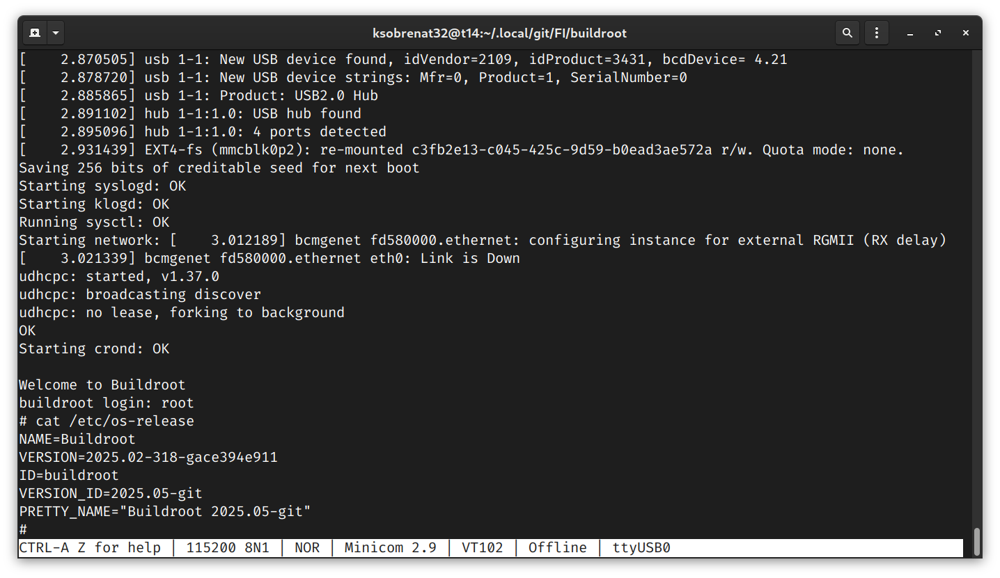
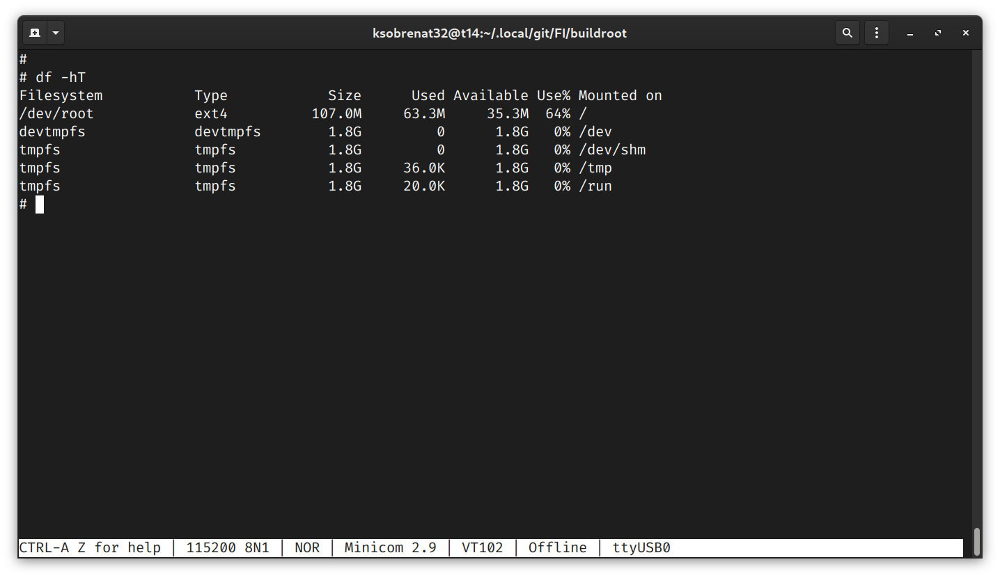
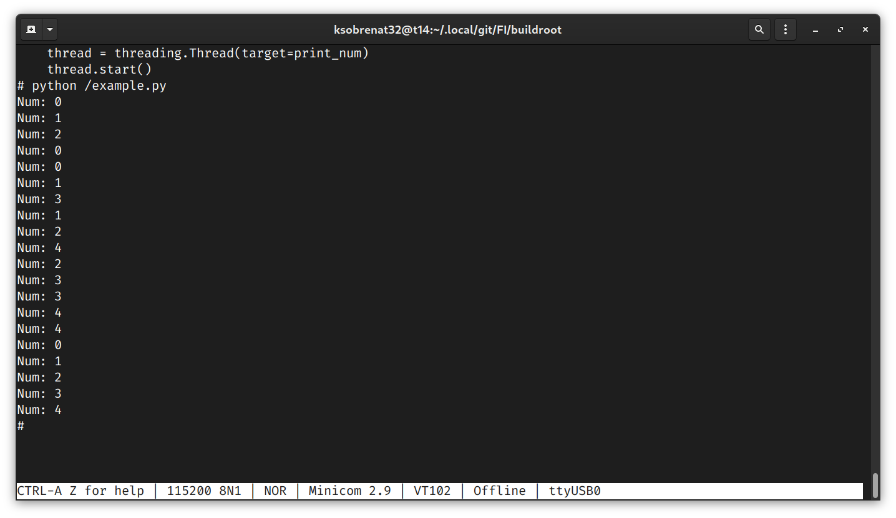
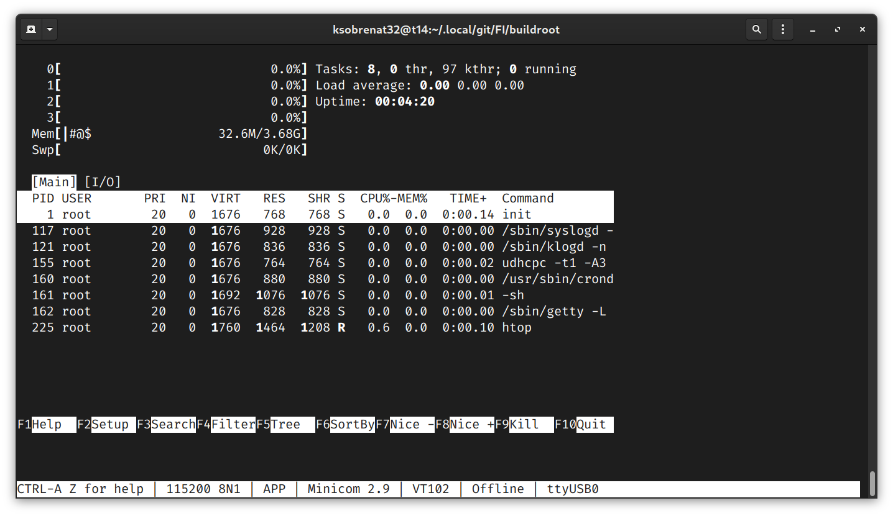

---
title:
- "Embinux"
author:
- \textsc{Enrique Calderón} \newline
- \textsc{Luis Ugartechea} \newline
institute:
- \textit{Universidad Nacional Autónoma de México\\ Facultad de Ingeniería}
date:
- April 28, 2025
---

# ¿Qué es Linux?

- Kernel creado por Linus Torvalds en 1991
- En unión con GNU (Richard Stallman, 1983) se vuelve un sistema operativo completo
- FOSS (Free and Open Source Software) basado en UNIX
- GNU/Linux es el nombre correcto, aunque comúnmente se le llama Linux

# ¿Qué es un sistema embebido?

- Sistema informático con hardware y software diseñado para función específica
- Controla funciones dentro de un sistema multifunción más grande
- Características:
  - Bajo consumo de energía
  - Bajo costo
  - Tamaño reducido
  - Fácil adaptación para otros dispositivos

# Componentes de sistemas embebidos

- **Microprocesador**: Núcleo del sistema, ejecuta instrucciones, controla operaciones
- **Memoria**:
  - RAM (datos temporales)
  - Flash (datos permanentes: firmware, SO, configuración)
- **Software**: La parte "inteligente", contiene instrucciones que ejecuta el sistema
- **Periféricos**: Permiten interacción con el exterior (sensores, actuadores, pantallas)

# Linux en sistemas embebidos

- Opción popular por flexibilidad, escalabilidad, estabilidad y ser open source
- Arquitectura modular permite adaptación a necesidades específicas
- Se pueden eliminar componentes innecesarios para ahorrar recursos
- Acceso a gran comunidad, herramientas y bibliotecas

# Ventajas de Linux embebido

- Acceso a comunidad, herramientas y bibliotecas
- Versiones específicas para recursos limitados:
  - Yocto
  - Buildroot
  - OpenWrt
  - Distribuciones como Raspbian
- Kernel configurable para hardware específico
- Reducción de tiempo de arranque y uso de memoria
- Integración de controladores específicos

# Casos comunes de uso

- **Routers y dispositivos de red**: Enrutadores, switches, firewalls
- **Televisores inteligentes y set-top boxes**: Smart TVs, dispositivos streaming
- **Automatización industrial**: PLCs, sistemas SCADA, paneles HMI
- **Electrodomésticos inteligentes**: Refrigeradores, aspiradoras robot, etc.
- **Automóviles**: Unidades de control, sistemas de infoentretenimiento
- **Dispositivos portátiles y wearables**: Relojes inteligentes, GPS, cámaras

# ¿Qué es buildroot?

- Herramienta de construcción de sistemas Linux embebidos
- Crea sistema Linux completo a partir de paquetes y configuraciones
- Utiliza cross-compilation para generar sistema para arquitectura diferente
- Incluye propio compilador y herramientas de construcción

# Herramientas necesarias

- **Compilador**: Buildroot puede generar uno basado en GCC (junto con una C standard library como glibc, uClibc-ng o musl).
- **Herramientas de construcción**: make, tar, gzip, etc.
- **Sistema operativo**: Cualquier distribución Linux
- **Conexión a internet**: Para descargar paquetes y herramientas
- **Hardware**: Computadora con capacidad suficiente (compilación puede tardar horas)

# Selección de hardware

- Buildroot permite compilar para cualquier arquitectura
- Compatible con gran variedad de hardware:
  - Microcontroladores
  - SBCs (Single Board Computers)
  - Computadoras de escritorio

# Configuración de buildroot



# Selección de biblioteca C



# Compilación

- Comando `make` inicia la compilación
- Genera imagen de disco para instalación
- No requiere compilador externo
- Detecta automáticamente número de núcleos

# Instalación

- Imagen de disco en carpeta `output/images`
- Se instala en el hardware seleccionado
- Método de instalación depende del hardware

# Ejemplo práctico: Raspberry Pi 4

## Hardware seleccionado

- Raspberry Pi 4 de 4GB
- Procesador ARM Cortex-A72
- Single Board Computer (SBC)
- Soporte para HDMI, USB y Ethernet
- Comunicación por conexión serial (adaptador USB a TTL)

# Configuración de buildroot

```bash
git clone https://github.com/buildroot/buildroot.git
make raspberrypi4_64_defconfig
```

- Configuración base para Raspberry Pi 4
- Genera archivo `.config` con opciones necesarias

# Configuración de herramientas

- `make menuconfig` para configuración adicional
- Selección de `musl` en lugar de `glibc` (menor tamaño)
- Aplicaciones incluidas:
  - vim (editor de texto)
  - python3 (intérprete)
  - htop (monitoreo del sistema)

# Configuración de aplicaciones



- Python3 como intérprete
- Vim como editor de texto
- Htop para monitoreo del sistema

# Configuración de aplicaciones



# Configuración de aplicaciones



# Compilación



- Proceso automático
- Detección de núcleos
- Descarga de dependencias
- Construcción completa del sistema

# Instalación

```bash
sudo dd if=output/images/sdcard.img \
of=/dev/sdX bs=4M status=progress
sync
```

- Copiar imagen a tarjeta SD
- Insertar en Raspberry Pi 4
- Encender y comprobar funcionamiento

# Pruebas realizadas



# Pruebas realizadas



# Funcionamiento de Python


# Funcionamiento de Python



# Monitoreo del sistema



# Conclusiones

## Ventajas de sistemas Linux embebidos

- Menor consumo de recursos
- Personalización completa
- Seguridad y estabilidad
- Amplia comunidad de soporte
- Disponibilidad de herramientas

## Aplicaciones futuras

- Internet de las Cosas (IoT)
- Sistemas industriales
- Automatización del hogar
- Robótica
- Dispositivos médicos

# Referencias

- Administrador CEUPE. Sistema embebido: Qué es, características y componentes
- Rebound Electronics. Explicación de los sistemas embebidos
- Red Hat. Definición de Linux
- TRBL Services. LINUX Embebido | Qué es, cómo funciona y para qué se usa
- Buildroot. Buildroot manual
- Equipo editorial de IONOS. Kernel - El núcleo del sistema operativo
